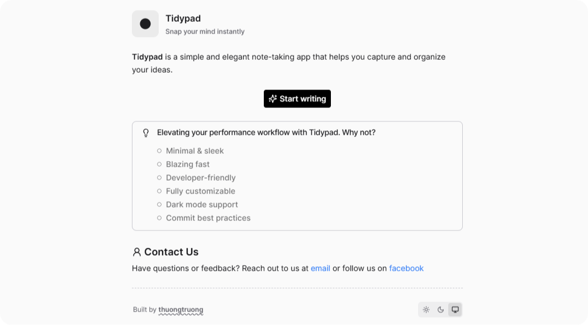
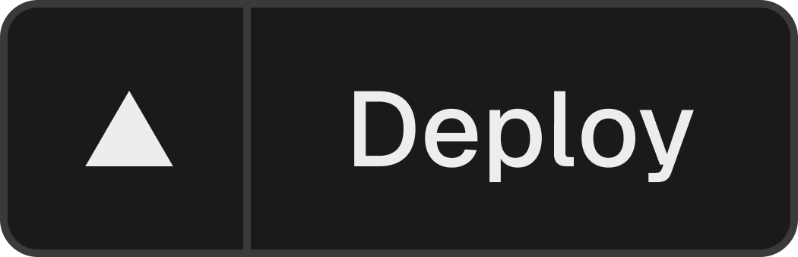

<p align="center">
	
	<h4 align="center">Tidypad</h4>
  <p align="center">Snap your mind instantly</p>
</p>

<p align="center">
  <picture>
    <source media="(prefers-color-scheme: dark)" srcset="https://res.cloudinary.com/ddkhkc3uu/image/upload/v1744549191/github-repo-icons/squiggly-line-light.svg">
    
  </picture>
</p>

<p align="center">
  <a href="https://nextjs.org/">
    
  </a>
  <a href="https://github.com/thuongtruong109/tidypad">
    
  </a>
  <a href="https://tidypad.vercel.app/">
    
  </a>
  <a href="https://github.com/thuongtruong109/tidypad/blob/main/LICENSE">
    
  </a>
</p>



<h4 align="center">
  Features
</h4>

**Clean structure** – easy to extend and scale

**Blazing fast** – optimized build and dev performance

**Tailwind CSS & animation ready** – with `tailwindcss-animate` and `framer-motion`

**Dark & light mode** – powered by `next-themes`

**PWA support** – via [`@serwist/next`](https://www.npmjs.com/package/@serwist/next)

**Developer-friendly** – commit linting, formatting, and type checking baked in

**Strict code quality** – powered by [`biome`](https://biomejs.dev/)

<h4 align="center">Folder Structures</h4>

```bash
├── public/             # Static assets
├── src/                # App source code
│   ├── app/            # Next.js app directory
│   ├── components/     # Reusable UI components
│   ├── lib/            # Utility functions & configs
├── .husky/             # Git hooks
├── biome.json          # BiomeJS config
├── tailwind.config.ts  # TailwindCSS config
├── postcss.config.js
└── README.md
```

<h4 align="center">Getting Started</h4>

## Quick Start

1. Create a project with the [starter template](https://github.com/thuongtruong109/tidypad/generate):

   ```bash
   npx degit thuongtruong109/tidypad my-tidypad
   ```

```bash
git clone https://github.com/thuongtruong109/tidypad
npm install
npm run dev
```

<p align="center">
  <a href="https://vercel.com/new/clone?repository-url=https://github.com/thuongtruong109/tidypad&env=NEXT_PUBLIC_SITE_URL&project-name=tidypad&repository-name=tidypad">
    
  </a>
</p>

<!-- https://github.dev/supabase/supabase/tree/master/examples/user-management/nextjs-user-management -->
